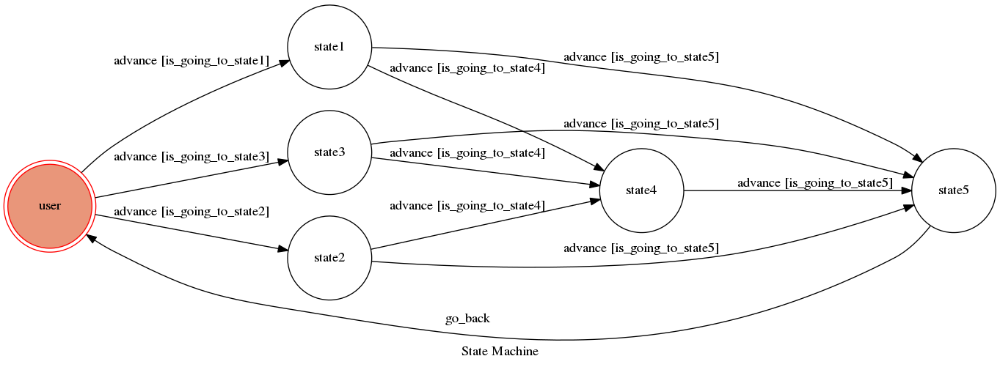

# TOC Project 2017

Template Code for TOC Project 2017

A telegram bot based on a finite state machine

## Finite State Machine

## Usage
這是一個打招呼機器人，專門撫慰邊緣人的心靈，讓他們三餐都有人可以聊天。

* user
	* 深度1：
		* Input: "早安"
			* Reply: "早安"

		* Input: "午安"
			* Reply: "午安"

		* Input: "晚安"
			* Reply: "晚安"
	* 深度2
		* Input: "掰掰"
			* Reply: "掰掰"
		* Input: "吃飯阿"
			* Reply: "不要"
	* 深度3
		* Input: "掰掰"
			* Reply: "掰掰"

